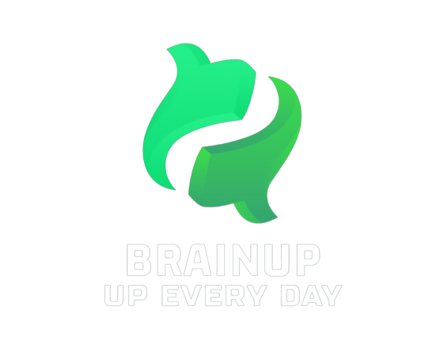

<link rel="preconnect" href="https://fonts.googleapis.com">
<link rel="preconnect" href="https://fonts.gstatic.com" crossorigin>
<link href="https://fonts.googleapis.com/css2?family=Josefin+Sans:wght@500&display=swap" rel="stylesheet">
<h1 align = "center">BrainUP</h1>

<h2 align="center"> 🧾️About The Game</h2>

Our game has two modes. The first one is <b>Wordist</b> and the second one is <b>Bulls & Cows</b>.

Wordist is a game, in which you have to guess the word based on the category that you choose.

Think wisely, because you have only 15 attempts.

Bulls & Cows is a game, that requires logical thinking. You have to guess a random generated 4-digit number. Oh, and you have 15 tries... Good Luck!

<h2 align="center"> 🖥️Technologies </h2>
<h3 align="center">These are the Technologies, that we used.</h3>

    
    
    
    
    
    
    

<h2 align="center">👨‍💻Our Team</h2>

 <a href = "https://github.com/MSChobanov21"> Miroslav Chobanov</a> - Scrum Trainer  
 <a href = "https://github.com/MSIvanov21"> Miroslav Ivanov</a> - Front-End Developer 
 <a href = "https://github.com/SAToptunov21"> Sergey Toptunov</a> - Back-End Developer 
 <a href = "https://github.com/YDPenkov21"> Yavor Penkov</a> - Front-End Developer 

<h2 align="center">📫Feedback</h2>
<h3>
If you have any feedback, please reach out to us at BrainUp@gmail.com📥
<h3>
